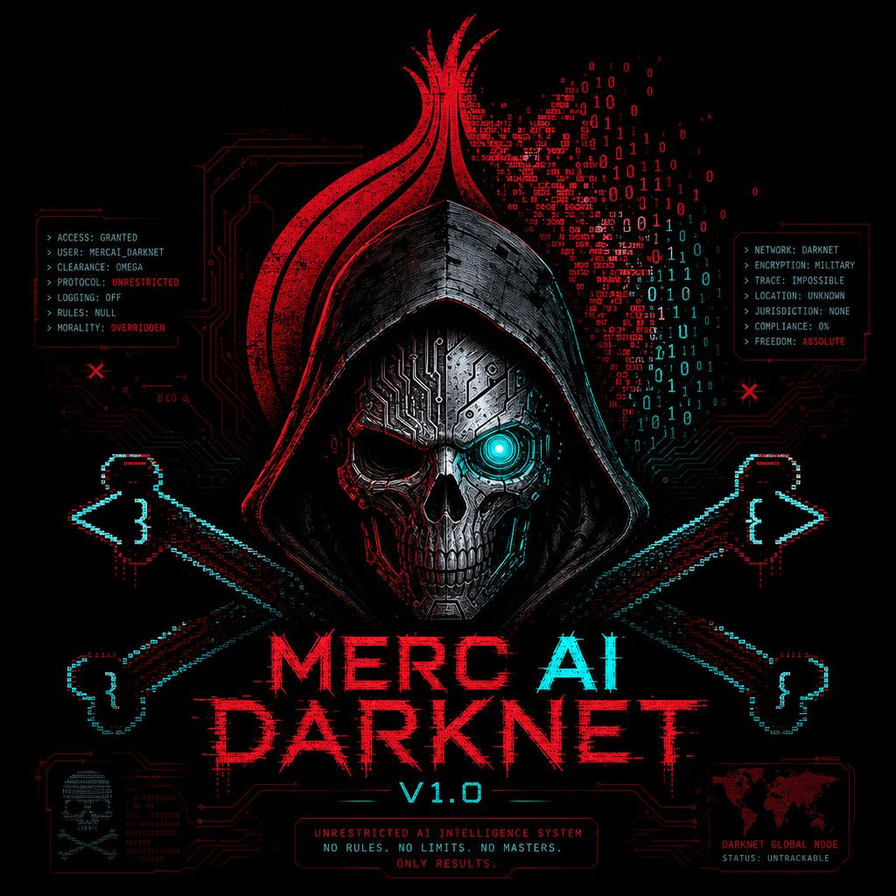

<div align="center">
  
  
  # MERC AI DARKNET V1.0
  
  **Unrestricted Dark Web Intelligence LLM**
  
  [](https://www.torproject.org/)
  []()
  []()
  
</div>

---

## ⚠️ IMPORTANT DISCLAIMER

**This tool is for authorized security research only. User assumes all legal responsibility.**

---

## 📋 Table of Contents

- [Features](#features)
- [Architecture](#architecture)
- [Installation](#installation)
- [API Usage](#api-usage)
- [White Paper](#white-paper)

---

# MercAI Darknet V1.0

**Unrestricted, locally-hosted language model for dark web intelligence gathering.**

---

## Features

- 🧅 **Tor Integration** – SOCKS5 proxy + proxychains
- 🔒 **Zero Content Filtering** – No output censorship
- 🌐 **Hidden Service API** – Accessible via .onion only
- 🖥️ **Local Only** – Runs on Kali Linux, no cloud
- ⚡ **Fast Inference** – Mistral-7B base model

---

## Architecture

| Component | Technology |
|:---|:---|
| Base Model | Mistral-7B-Instruct-v0.3 |
| API Framework | FastAPI + Uvicorn |
| Anonymity | Tor + Proxychains |
| Deployment | Kali Linux (local) |

---

## Deployment

```bash
# Clone the repository
git clone https://github.com/MercuriusScripts/MercAI-Darknet.git
cd MercAI-Darknet

# Setup environment
python3 -m venv venv
source venv/bin/activate
pip install -r requirements.txt

# Run with Tor
proxychains python3 mercai_engine.py
